Respo Data Analysis
================
Micaela Chapuis
2026-10-02

# Code for Light/Dark Respo Analysis

### Created by: Nyssa Silbiger, updated by Maya Powell

This code takes the output from the respo_raw_processing code, as well
as information about the respo runs and tile/chamber measurements, and:

- blank-corrects rates
- normalizes them to surface area and dry weight
- calculates respiration, net photosynthesis and gross photosynthesis
  rates

## Load Libraries

``` r
library(tidyverse) 
library(here) 
library(patchwork)
```

## Load Data

``` r
respo_data <-read_csv(here("Data", "Respo", "Pilot", "pilot_tile_respirometry.csv"))
tile_measurements <- read_csv(here("Data","Respo","tile_measurements.csv"))
respo_output <- read_csv(here("Data", "Respo", "Pilot", "respo_lightdark_output.csv"))
comm_comp <- read_csv(here("Data", "encrusting_turf_ratio.csv")) %>% select(-"...1")
```

## Join respo metadata and tile measurements

``` r
sample_data <- left_join(respo_data, tile_measurements, by = join_by(sample_ID, tile_ID))
```

### Calculate Respiration Rate

``` r
respo_rates <- respo_output %>%
  left_join(sample_data) %>% # Join the raw respo calculations with the metadata
  mutate(chamber_volume_l = chamber_volume_ml * 0.001,  # mL to L conversion
         umol_sec = umol_liter_sec * chamber_volume_l) %>% # Account for chamber volume to convert from umol L-1 s-1 to umol s-1. This standardizes across water volumes (different because different communities on each tile, thickness of epoxy, etc) and removes per Liter
  mutate_if(sapply(., is.character), as.factor)  # convert character columns to factors
```

    ## Joining with `by = join_by(sample_ID, run_block, light_dark, light_level)`

### Normalize Respiration Rates to Blanks

``` r
rates_normalized <- respo_rates %>% 
  filter(blank == 1) %>% # grab the blanks
  group_by(run_block, light_dark) %>% # can't group by light level because they're slightly different for different respo stands
  summarise(blank_rate = mean(umol_sec, na.rm = TRUE)) %>% # if you have multiple blanks per run take the average
  ungroup() %>% 
  #dplyr::select(Light_level, run_block, blank_rate, date) %>% # this is what I will use to join the blanks back with the raw data
  right_join(respo_rates) %>% # join blanks with the respo data
  mutate(
      # Blank corrected rates
        umol_sec_corrected = umol_sec - blank_rate, # Blank corrected rates = subtract the blank rates from the raw rates   
      # Rates in micromols, normalized to surface area (in cm2)   
         umol_cm2_hr_uncorrected = (umol_sec*3600)/surface_area_cm2,
         umol_cm2_hr = (umol_sec_corrected*3600)/surface_area_cm2, 
      # Rates in micromols, normalized to dry weight (in g)
         umol_g_hr_uncorrected = (umol_sec*3600)/dry_weight_g, 
         umol_g_hr = (umol_sec_corrected*3600)/dry_weight_g,
      # Rates in millimols, normalized to surface area (in cm2)
         mmol_cm2_hr_uncorrected = 0.001*(umol_sec*3600)/surface_area_cm2,
         mmol_cm2_hr = 0.001*(umol_sec_corrected*3600)/surface_area_cm2, # convert to mmol cm-2 hr-1, normalized to surface area
      # Rates in millimols, normalized to dry weight (in g)
         mmol_g_hr_uncorrected = 0.001*(umol_sec*3600)/dry_weight_g,
         mmol_g_hr = 0.001*(umol_sec_corrected*3600)/dry_weight_g
        ) %>% 
  filter(blank!=1) %>% # remove the Blank data
  select(respo_date, sample_ID, tile_ID, treatment, light_dark, run_block, surface_area_cm2, dry_weight_g, umol_cm2_hr,umol_cm2_hr_uncorrected, umol_g_hr, umol_g_hr_uncorrected, mmol_cm2_hr_uncorrected, mmol_cm2_hr, mmol_g_hr_uncorrected, mmol_g_hr, channel_number, temp_C, light_level) #keep only what we need
```

## Making a dataframe for blank data for future use in plots

``` r
blanks_only <- respo_rates %>% 
  filter(blank == 1) %>% # grab the blanks
  group_by(light_dark, run_block) %>%
  summarise(blank_rate = mean(umol_sec, na.rm = TRUE))
```

## Plot the blanks across treatments to make sure everything looks good

``` r
blanks_only %>%
  ggplot(aes(x = light_dark, y = blank_rate)) +
  geom_boxplot(alpha = 0.4) + geom_point()
```

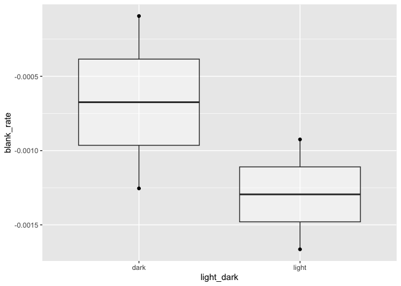<!-- -->

### Respiration, Net + Gross Photosynthesis Rates, Normalized to Surface Area

``` r
rates_PR_SAnorm <- rates_normalized %>%
  select(-c(light_level,temp_C, # remove the things that make light and dark runs different and keep them in separate rows
            umol_cm2_hr_uncorrected, umol_g_hr, umol_g_hr_uncorrected, mmol_cm2_hr_uncorrected, mmol_cm2_hr, mmol_g_hr_uncorrected, mmol_g_hr)) %>% # remove uncorrected column, dry weight column, and mmol colums to pivot
  pivot_wider(names_from = light_dark, 
              values_from = umol_cm2_hr) %>%  # makes light and dark columns with the rates for their respective run 
  rename(respiration = dark , net_photosynthesis = light) %>% # rename the columns
  mutate(respiration = -1 * respiration,  # Make respiration positive
         gross_photosynthesis = respiration + net_photosynthesis) %>% 
  pivot_longer(cols = respiration:gross_photosynthesis, names_to = "PR", values_to = "values") #values still in umol.cm2.hr

rates_PR_SAnorm
```

    ## # A tibble: 60 × 10
    ##    respo_date sample_ID          tile_ID treatment run_block surface_area_cm2
    ##    <date>     <fct>              <fct>   <fct>     <fct>                <dbl>
    ##  1 2026-09-09 20260909_003B_RUN1 003B    black     run1                  51.2
    ##  2 2026-09-09 20260909_003B_RUN1 003B    black     run1                  51.2
    ##  3 2026-09-09 20260909_003B_RUN1 003B    black     run1                  51.2
    ##  4 2026-09-09 20260909_016A_RUN1 016A    white     run1                  51.9
    ##  5 2026-09-09 20260909_016A_RUN1 016A    white     run1                  51.9
    ##  6 2026-09-09 20260909_016A_RUN1 016A    white     run1                  51.9
    ##  7 2026-09-09 20260909_029A_RUN1 029A    white     run1                  54.1
    ##  8 2026-09-09 20260909_029A_RUN1 029A    white     run1                  54.1
    ##  9 2026-09-09 20260909_029A_RUN1 029A    white     run1                  54.1
    ## 10 2026-09-09 20260909_001A_RUN1 001A    white     run1                  50.4
    ## # ℹ 50 more rows
    ## # ℹ 4 more variables: dry_weight_g <dbl>, channel_number <dbl>, PR <chr>,
    ## #   values <dbl>

``` r
write_csv(rates_PR_SAnorm,here("Data","Respo", "Pilot", "Respo Outputs", "PnR_rates_SAnorm.csv")) # export all the uptake rates
```

### Respiration, Net + Gross Photosynthesis Rates, Normalized to Dry Weights

``` r
rates_PR_DWnorm <- rates_normalized %>%
  select(-c(light_level,temp_C, # remove the things that make light and dark runs different and keep them in separate rows
            umol_g_hr_uncorrected, umol_cm2_hr, umol_cm2_hr_uncorrected, mmol_cm2_hr_uncorrected, mmol_cm2_hr, mmol_g_hr_uncorrected, mmol_g_hr)) %>% # remove uncorrected column, dry weight column, and mmol colums to pivot
  pivot_wider(names_from = light_dark, 
              values_from = umol_g_hr) %>%  # makes light and dark columns with the rates for their respective run 
  rename(respiration = dark , net_photosynthesis = light) %>% # rename the columns
  mutate(respiration = -1 * respiration,  # Make respiration positive
         gross_photosynthesis = respiration + net_photosynthesis) %>% 
  pivot_longer(cols = respiration:gross_photosynthesis, names_to = "PR", values_to = "values") #values still in umol.cm2.hr

rates_PR_DWnorm
```

    ## # A tibble: 60 × 10
    ##    respo_date sample_ID          tile_ID treatment run_block surface_area_cm2
    ##    <date>     <fct>              <fct>   <fct>     <fct>                <dbl>
    ##  1 2026-09-09 20260909_003B_RUN1 003B    black     run1                  51.2
    ##  2 2026-09-09 20260909_003B_RUN1 003B    black     run1                  51.2
    ##  3 2026-09-09 20260909_003B_RUN1 003B    black     run1                  51.2
    ##  4 2026-09-09 20260909_016A_RUN1 016A    white     run1                  51.9
    ##  5 2026-09-09 20260909_016A_RUN1 016A    white     run1                  51.9
    ##  6 2026-09-09 20260909_016A_RUN1 016A    white     run1                  51.9
    ##  7 2026-09-09 20260909_029A_RUN1 029A    white     run1                  54.1
    ##  8 2026-09-09 20260909_029A_RUN1 029A    white     run1                  54.1
    ##  9 2026-09-09 20260909_029A_RUN1 029A    white     run1                  54.1
    ## 10 2026-09-09 20260909_001A_RUN1 001A    white     run1                  50.4
    ## # ℹ 50 more rows
    ## # ℹ 4 more variables: dry_weight_g <dbl>, channel_number <dbl>, PR <chr>,
    ## #   values <dbl>

``` r
write_csv(rates_PR_SAnorm,here("Data","Respo", "Pilot", "Respo Outputs", "PnR_rates_DWnorm.csv")) # export all the uptake rates
```

### Add Community Comp Data to Rates Files (pivot wider)

``` r
rates_SA_long <- rates_PR_SAnorm %>% 
  pivot_wider(names_from = "PR", 
              values_from = "values") %>%
  left_join(comm_comp,  by = c("tile_ID" = "tile_id", "treatment", "respo_date" = "date"))
```

``` r
rates_DW_long <- rates_PR_DWnorm %>% 
  pivot_wider(names_from = "PR", 
              values_from = "values") %>% 
  left_join(comm_comp,  by = c("tile_ID" = "tile_id", "treatment", "respo_date" = "date"))
```

## Plots

#### Algae Biomass by Treatment

``` r
tile_measurements %>%
  filter(treatment %in% c("white", "black")) %>%
  ggplot(aes(x = treatment, y = dry_weight_g, color = treatment)) +
  geom_jitter() +
  geom_boxplot(alpha = 0.4) +
  theme_bw() +
  labs(y = "Dry Algae Biomass (g)") +
  guides(color = "none")
```

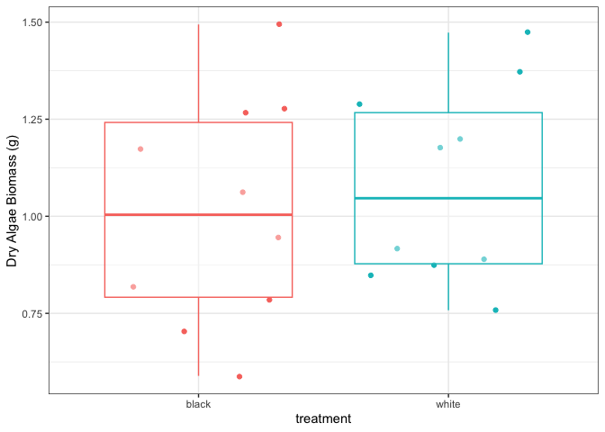<!-- -->

``` r
tile_measurements %>% 
  filter(treatment %in% c("white", "black")) %>% 
  group_by(treatment) %>% 
  summarize(mean_weight = mean(dry_weight_g))
```

    ## # A tibble: 2 × 2
    ##   treatment mean_weight
    ##   <chr>           <dbl>
    ## 1 black            1.01
    ## 2 white            1.08

#### Photosynthesis + Respiration Plot, Surface Area Normalized

``` r
rates_PR_SAnorm %>% 
  ggplot(aes(x = treatment, y = values, color = treatment)) +
  geom_jitter() +
  geom_boxplot(alpha = 0.4) +
  facet_wrap(~PR ,scales = "free") + #*run_block, nrow = 3
  theme_bw() +
  labs(x = "Treatment", y = "umol.cm2.hr")+
  theme(strip.background = element_rect(fill = "white"),
        strip.text = element_text(face = "bold")) +
  guides(color = "none")
```

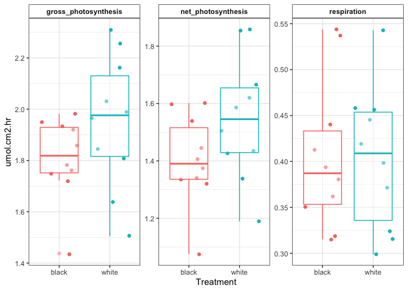<!-- -->

#### Photosynthesis + Respiration Plot, Dry Weight Normalized

``` r
rates_PR_DWnorm %>% 
  ggplot(aes(x = treatment, y = values, color = treatment)) +
  geom_jitter() +
  geom_boxplot(alpha = 0.4) +
  facet_wrap(~PR, scales = "free") +
  theme_bw() +
  labs(x = "Treatment", y = "umol.g.hr")+
  theme(strip.background = element_rect(fill = "white"),
        strip.text = element_text(face = "bold")) +
  guides(color = "none")
```

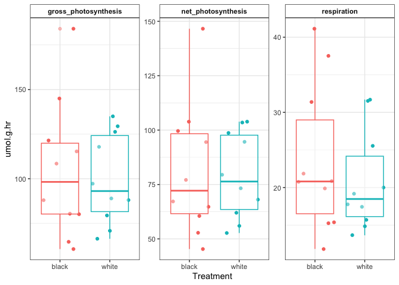<!-- -->

``` r
rates_PR_SAnorm %>% 
  group_by(treatment, PR) %>% 
  summarize(mean_value = mean(values))
```

    ## `summarise()` has regrouped the output.
    ## ℹ Summaries were computed grouped by treatment and PR.
    ## ℹ Output is grouped by treatment.
    ## ℹ Use `summarise(.groups = "drop_last")` to silence this message.
    ## ℹ Use `summarise(.by = c(treatment, PR))` for per-operation grouping
    ##   (`?dplyr::dplyr_by`) instead.

    ## # A tibble: 6 × 3
    ## # Groups:   treatment [2]
    ##   treatment PR                   mean_value
    ##   <fct>     <chr>                     <dbl>
    ## 1 black     gross_photosynthesis      1.81 
    ## 2 black     net_photosynthesis        1.40 
    ## 3 black     respiration               0.405
    ## 4 white     gross_photosynthesis      1.95 
    ## 5 white     net_photosynthesis        1.55 
    ## 6 white     respiration               0.403

``` r
rates_PR_DWnorm %>% 
  group_by(treatment, PR) %>% 
  summarize(mean_value = mean(values))
```

    ## `summarise()` has regrouped the output.
    ## ℹ Summaries were computed grouped by treatment and PR.
    ## ℹ Output is grouped by treatment.
    ## ℹ Use `summarise(.groups = "drop_last")` to silence this message.
    ## ℹ Use `summarise(.by = c(treatment, PR))` for per-operation grouping
    ##   (`?dplyr::dplyr_by`) instead.

    ## # A tibble: 6 × 3
    ## # Groups:   treatment [2]
    ##   treatment PR                   mean_value
    ##   <fct>     <chr>                     <dbl>
    ## 1 black     gross_photosynthesis      105. 
    ## 2 black     net_photosynthesis         81.2
    ## 3 black     respiration                23.6
    ## 4 white     gross_photosynthesis       99.9
    ## 5 white     net_photosynthesis         79.2
    ## 6 white     respiration                20.7

#### Gross Photosynthesis Plot, Surface Area Normalized

``` r
rates_PR_SAnorm %>% filter(PR == "gross_photosynthesis") %>%
  ggplot(aes(x = treatment, y = values, color = treatment)) +
  geom_jitter() +
  geom_boxplot(alpha = 0.4) +
  theme_bw() +
  labs(y ="Gross Photosynthesis (umol.cm2.hr)") +
  guides(color = "none")
```

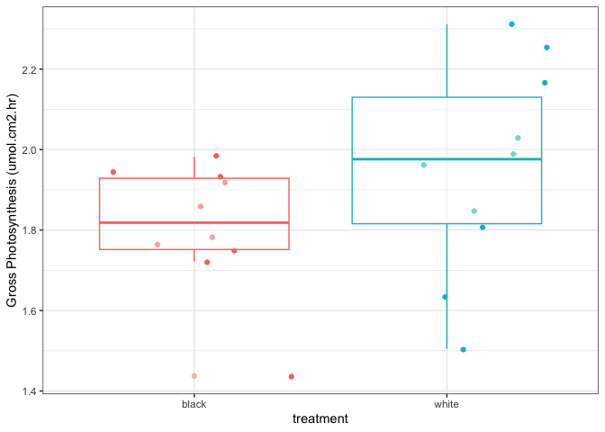<!-- -->

#### Gross Photosynthesis Plot, Dry Weight Normalized

``` r
rates_PR_DWnorm %>% filter(PR == "gross_photosynthesis") %>%
  ggplot(aes(x = treatment, y = values, color = treatment)) +
  geom_jitter() +
  geom_boxplot(alpha = 0.4) +
  theme_bw() +
  labs(y ="Gross Photosynthesis (umol.g.hr)") +
  guides(color = "none")
```

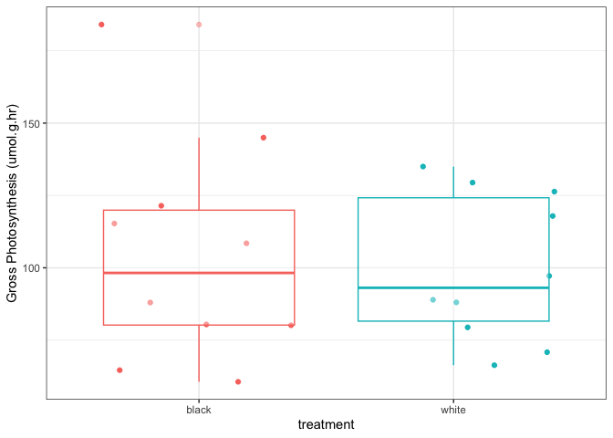<!-- -->

#### Net Photosynthesis Plot, Surface Area Normalized

``` r
rates_PR_SAnorm %>% filter(PR == "net_photosynthesis") %>%
  ggplot(aes(x = treatment, y = values, color = treatment)) +
  geom_jitter() +
  geom_boxplot(alpha = 0.4) +
  theme_bw() +
  labs(y ="Net Photosynthesis (umol.cm2.hr)") +
  guides(color = "none")
```

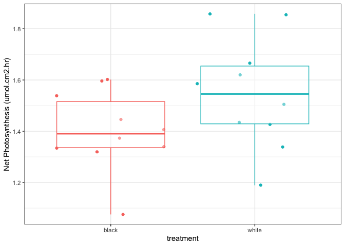<!-- -->

#### Net Photosynthesis Plot, Dry Weight Normalized

``` r
rates_PR_DWnorm %>% filter(PR == "net_photosynthesis") %>%
  ggplot(aes(x = treatment, y = values, color = treatment)) +
  geom_jitter() +
  geom_boxplot(alpha = 0.4) +
  theme_bw() +
  labs(y ="Net Photosynthesis (umol.g.hr)") +
  guides(color = "none")
```

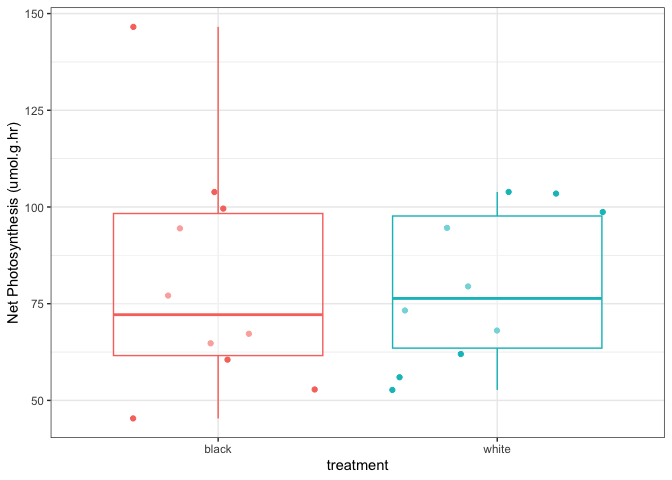<!-- -->

#### Respiration Plot, Surface Area Normalized

``` r
rates_PR_SAnorm %>% filter(PR == "respiration") %>%
  ggplot(aes(x = treatment, y = values, color = treatment)) +
  geom_jitter() +
  geom_boxplot(alpha = 0.4) +
  theme_bw() +
  labs(y ="Respiration (umol.cm2.hr)") +
  guides(color = "none")
```

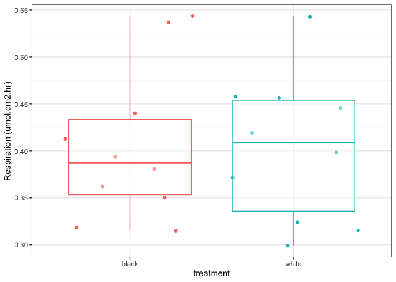<!-- -->

#### Respiration Plot, Dry Weight Normalized

``` r
rates_PR_DWnorm %>% filter(PR == "respiration") %>%
  ggplot(aes(x = treatment, y = values, color = treatment)) +
  geom_jitter() +
  geom_boxplot(alpha = 0.4) +
  theme_bw() +
  labs(y ="Respiration (umol.g.hr)") +
  guides(color = "none")
```

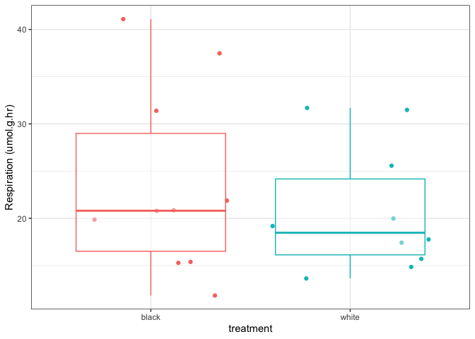<!-- -->

#### Rates by Tile

``` r
rates_normalized %>%
  ggplot(aes(x = tile_ID, y = umol_cm2_hr, color = light_dark))+
  geom_point() +
  facet_wrap(~treatment, scales = "free_x")
```

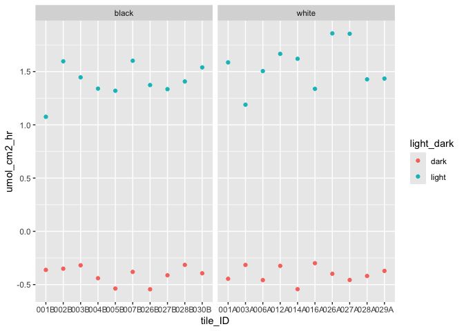<!-- -->

#### Rates vs Encrusting/Turf Ratio

##### Net Photo, Surface Area Normalized

``` r
rates_SA_long %>% 
  ggplot(aes(x = ratio, y = net_photosynthesis)) + 
  geom_point() + 
  geom_smooth(method = "lm") +
  #facet_wrap(~treatment) + 
  theme_bw() +
  labs(x = "Encrusting/Turf Ratio")
```

    ## `geom_smooth()` using formula = 'y ~ x'

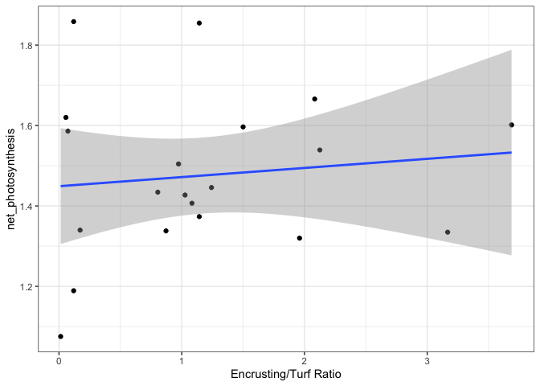<!-- -->

``` r
# higher ratio means more encrusting algae relative to turf
```

##### Net Photo, Dry Weight Normalized

``` r
rates_DW_long %>% 
  ggplot(aes(x = ratio, y = net_photosynthesis)) + 
  geom_point() + 
  geom_smooth(method = "lm") +
  #facet_wrap(~treatment) + 
  theme_bw() +
  labs(x = "Encrusting/Turf Ratio")
```

    ## `geom_smooth()` using formula = 'y ~ x'

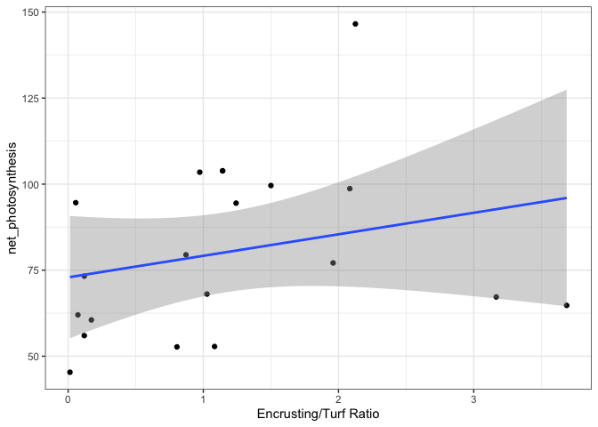<!-- -->

##### Gross Photo, Surface Area Normalized

``` r
rates_SA_long %>% 
  ggplot(aes(x = ratio, y = gross_photosynthesis)) + 
  geom_point() + 
  geom_smooth(method = "lm") +
  #facet_wrap(~treatment) + 
  theme_bw() +
  labs(x = "Encrusting/Turf Ratio")
```

    ## `geom_smooth()` using formula = 'y ~ x'

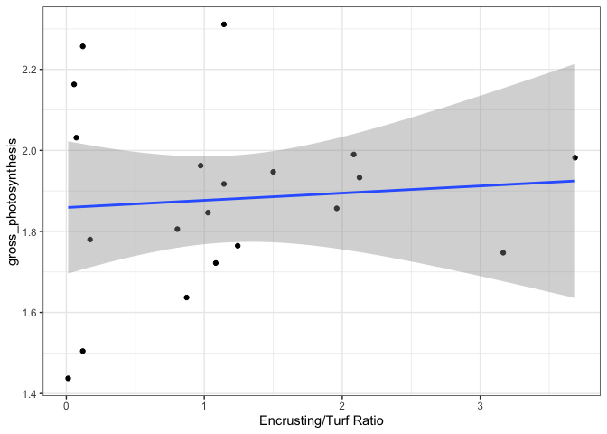<!-- -->

##### Gross Photo, Dry Weight Normalized

``` r
rates_DW_long %>% 
  ggplot(aes(x = ratio, y = gross_photosynthesis)) + 
  geom_point() + 
  geom_smooth(method = "lm") +
  #facet_wrap(~treatment) + 
  theme_bw() +
  labs(x = "Encrusting/Turf Ratio")
```

    ## `geom_smooth()` using formula = 'y ~ x'

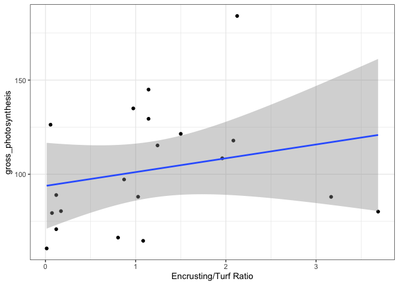<!-- -->

##### Respiration, Surface Area Normalized

``` r
rates_SA_long %>% 
  ggplot(aes(x = ratio, y = respiration)) + 
  geom_point() + 
  geom_smooth(method = "lm") +
  #facet_wrap(~treatment) + 
  theme_bw() +
  labs(x = "Encrusting/Turf Ratio")
```

    ## `geom_smooth()` using formula = 'y ~ x'

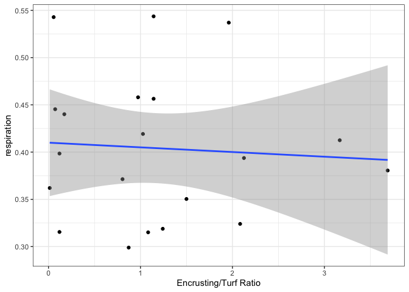<!-- -->

##### Respiration, Dry Weight Normalized

``` r
rates_DW_long %>% 
  ggplot(aes(x = ratio, y = respiration)) + 
  geom_point() + 
  geom_smooth(method = "lm") +
  #facet_wrap(~treatment) + 
  theme_bw() +
  labs(x = "Encrusting/Turf Ratio")
```

    ## `geom_smooth()` using formula = 'y ~ x'

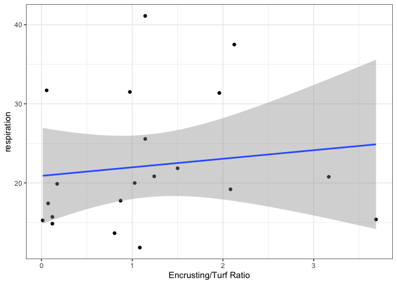<!-- -->
