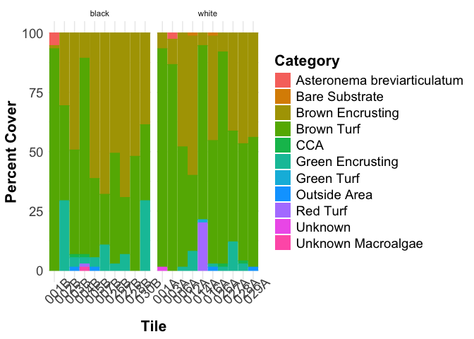
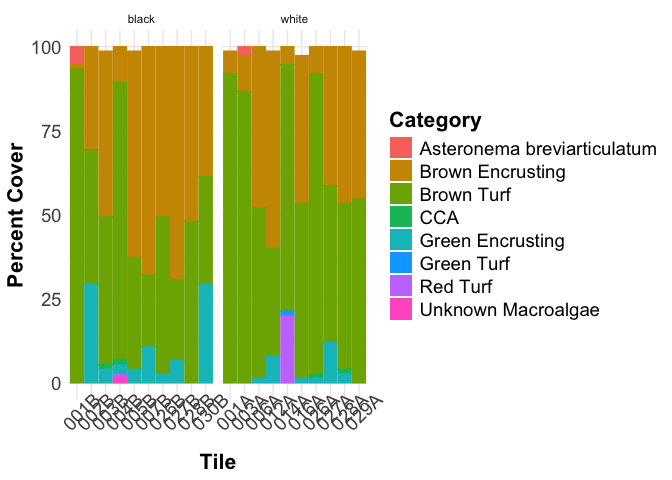
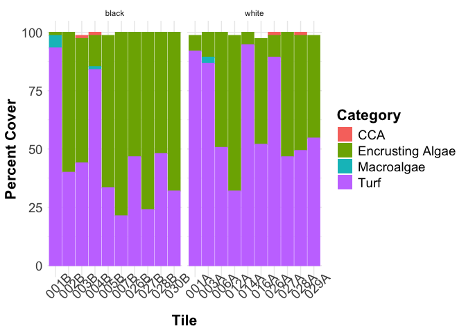
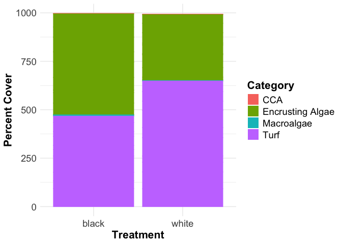

Tile Community Composition Analysis
================
Micaela Chapuis
2026-10-03

## Load Libraries

``` r
library(tidyverse)
library(here)
library(janitor)
```

## Load Data

``` r
cover <- read_csv(here("Data", "pilot_random_annotations.csv")) %>% select(-c(Aux4, Aux5, Row, Column)) %>% clean_names() # remove columns I don't need and clean column names
tile_measurements <- read_csv(here("Data", "Respo", "tile_measurements.csv"))
```

Join with tile measurements and filter out non-respo tiles

``` r
cover <- left_join(cover, tile_measurements, by = c("tile_id" = "tile_ID")) %>% 
  filter(treatment %in% c("white", "black")) %>%
  select(-c("sample_ID", "chamber_volume_ml", "notes"))
```

Editing labels

``` r
cover <- cover %>% mutate(label_code = replace_values(label_code,
                                                      "BTurf" ~ "Brown Turf",
                                                      "BEA" ~ "Brown Encrusting",
                                                      "Unk" ~ "Unknown",
                                                      "ABREV" ~ "Asteronema breviarticulatum", 
                                                      "GEA" ~ "Green Encrusting",
                                                     # "CCA"  not including it retains original value
                                                      "Outside" ~ "Outside Area",
                                                      "UnkMacroa" ~ "Unknown Macroalgae",
                                                      "RedTurf" ~ "Red Turf",
                                                      "Bare-Subst" ~ "Bare Substrate",
                                                      "GTurf" ~ "Green Turf",
                                                      "Unk_Inv" ~ "Unknown Invert"))
```

Calculating percent cover by label

``` r
percent_cover <- cover %>% 
  group_by(date, site, tile_id, treatment, label_code) %>%
  summarise(num_points = n()) %>% # calculate number of points for each label
  mutate(total_points = sum(num_points), # create a column with the total points on each tile
         percent_cover = num_points/total_points*100) # calculate percent cover for each label
```

    ## `summarise()` has regrouped the output.
    ## ℹ Summaries were computed grouped by date, site, tile_id, treatment, and
    ##   label_code.
    ## ℹ Output is grouped by date, site, tile_id, and treatment.
    ## ℹ Use `summarise(.groups = "drop_last")` to silence this message.
    ## ℹ Use `summarise(.by = c(date, site, tile_id, treatment, label_code))` for
    ##   per-operation grouping (`?dplyr::dplyr_by`) instead.

``` r
percent_cover %>% 
  ggplot(aes(x= tile_id,
               y = percent_cover, 
               fill= label_code, 
               color= label_code)) + # set lines surrounding each color to match the fill colors 
      geom_bar(stat="identity") + # stacked bars
      facet_wrap(~treatment, scales = "free_x") + 
  
      labs(x = "Tile", # labels
           y="Percent Cover",
           fill = "Category") +

      theme_minimal() +  # theme
      theme(title = element_text(size = 18, face = "bold"), # make title bigger and bold
            axis.title = element_text(size = 16), # make all text bigger
            axis.text = element_text(size = 14),
            axis.text.x = element_text(angle = 45),
            legend.title = element_text(size = 16),
            legend.text = element_text(size = 14)) +
    guides(color = "none")
```

<!-- -->

Filtering out some categories to get just producers

``` r
producer_cover <- percent_cover %>% 
  filter(!(label_code %in% c("Bare Substrate", "Outside Area", "Unknown"))) #%>%
#  mutate(total_points = sum(num_points), # recalculate total points after filter
#         percent_cover = num_points/total_points*100) # recalculate percent cover of producers
```

``` r
producer_cover %>% 
  ggplot(aes(x= tile_id,
               y = percent_cover, 
               fill= label_code, 
               color= label_code)) + # set lines surrounding each color to match the fill colors 
      geom_bar(stat="identity") + # stacked bars
      facet_wrap(~treatment, scales = "free_x") + 
  
      labs(x = "Tile", # labels
           y="Percent Cover",
           fill = "Category") +

      theme_minimal() +  # theme
      theme(title = element_text(size = 18, face = "bold"), # make title bigger and bold
            axis.title = element_text(size = 16), # make all text bigger
            axis.text = element_text(size = 14),
            axis.text.x = element_text(angle = 45),
            legend.title = element_text(size = 16),
            legend.text = element_text(size = 14)) +
    guides(color = "none")
```

<!-- -->

## Assign to broader categories

``` r
producer_cat <- cover %>%
  mutate(category = case_when(
    label_code %in% c("Brown Encrusting", "Green Encrusting") ~ "Encrusting Algae",
    label_code %in% c("Brown Turf", "Red Turf", "Green Turf") ~ "Turf",
    label_code %in% c("Asteronema breviarticulatum", "Unknown Macroalgae") ~ "Macroalgae",
    label_code == "CCA" ~ "CCA",
    label_code %in% c("Bare Substrate", "Outside Area", "Unknown") ~ "Non-Producers")) %>%
  group_by(date, site, tile_id, treatment, category) %>%
  summarise(num_points = n()) %>% # calculate number of points for each category
  mutate(total_points = sum(num_points), # create a column with the total points on each tile
         percent_cover = num_points/total_points*100) %>% # recalculate percent cover for each category, total points still the same as before
  filter(!category == "Non-Producers")
```

    ## `summarise()` has regrouped the output.
    ## ℹ Summaries were computed grouped by date, site, tile_id, treatment, and
    ##   category.
    ## ℹ Output is grouped by date, site, tile_id, and treatment.
    ## ℹ Use `summarise(.groups = "drop_last")` to silence this message.
    ## ℹ Use `summarise(.by = c(date, site, tile_id, treatment, category))` for
    ##   per-operation grouping (`?dplyr::dplyr_by`) instead.

``` r
producer_cat %>% 
  ggplot(aes(x= tile_id,
               y = percent_cover, 
               fill= category, 
               color= category)) + # set lines surrounding each color to match the fill colors 
      geom_bar(stat="identity") + # stacked bars
      facet_wrap(~treatment, scales = "free_x") + 
  
      labs(x = "Tile", # labels
           y="Percent Cover",
           fill = "Category") +

      theme_minimal() +  # theme
      theme(title = element_text(size = 18, face = "bold"), # make title bigger and bold
            axis.title = element_text(size = 16), # make all text bigger
            axis.text = element_text(size = 14),
            axis.text.x = element_text(angle = 45),
            legend.title = element_text(size = 16),
            legend.text = element_text(size = 14)) +
    guides(color = "none")
```

<!-- -->

``` r
producer_cat %>% 
  ggplot(aes(x= treatment,
               y = percent_cover, 
               fill= category, 
               color= category)) + # set lines surrounding each color to match the fill colors 
      geom_bar(stat="identity") + # stacked bars
    
      labs(x = "Treatment", # labels
           y="Percent Cover",
           fill = "Category") +

      theme_minimal() +  # theme
      theme(title = element_text(size = 18, face = "bold"), # make title bigger and bold
            axis.title = element_text(size = 16), # make all text bigger
            axis.text = element_text(size = 14),
            legend.title = element_text(size = 16),
            legend.text = element_text(size = 14)) +
    guides(color = "none")
```

<!-- -->

## Encrusting vs Turf

Switching to just encrusting/turf (encrusting includes CCA and turf will
include macro, which for now is just asteronema and other unidentified
small macroalgae)

``` r
encr_turf <- cover %>%
  mutate(category = case_when(
    label_code %in% c("Brown Encrusting", "Green Encrusting", "CCA") ~ "Encrusting Algae",
    label_code %in% c("Brown Turf", "Red Turf", "Green Turf", "Asteronema breviarticulatum", "Unknown Macroalgae") ~ "Turf",
    label_code %in% c("Bare Substrate", "Outside Area", "Unknown") ~ "Non-Producers")) %>%
  group_by(date, site, tile_id, treatment, category) %>%
  summarise(num_points = n()) %>% # calculate number of points for each category
  mutate(total_points = sum(num_points), # create a column with the total points on each tile
         percent_cover = num_points/total_points*100) %>% # recalculate percent cover for each category, total points still the same as before
  filter(!category == "Non-Producers")
```

    ## `summarise()` has regrouped the output.
    ## ℹ Summaries were computed grouped by date, site, tile_id, treatment, and
    ##   category.
    ## ℹ Output is grouped by date, site, tile_id, and treatment.
    ## ℹ Use `summarise(.groups = "drop_last")` to silence this message.
    ## ℹ Use `summarise(.by = c(date, site, tile_id, treatment, category))` for
    ##   per-operation grouping (`?dplyr::dplyr_by`) instead.

``` r
ratio <- encr_turf %>%
  select(-c("num_points", "total_points")) %>%
  pivot_wider(
    names_from = "category",
    values_from = "percent_cover") %>%
  mutate(ratio = `Encrusting Algae`/Turf)
```

``` r
ratio %>% write.csv(here("Data", "encrusting_turf_ratio.csv"))
```
