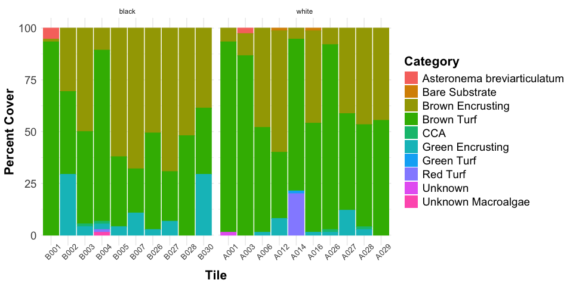
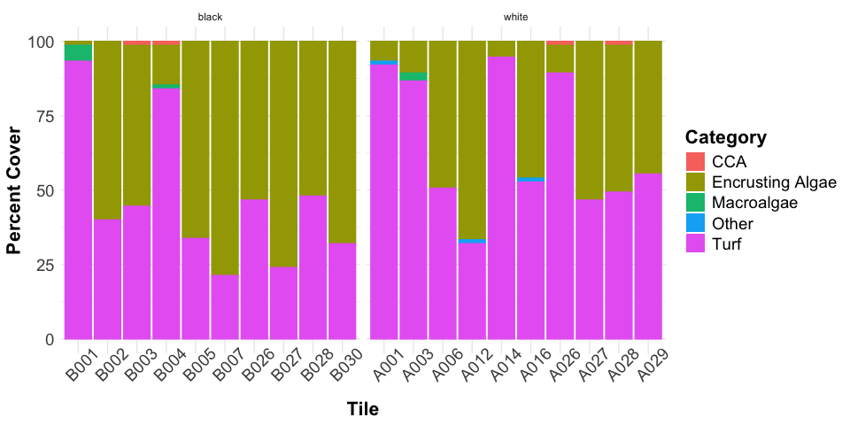
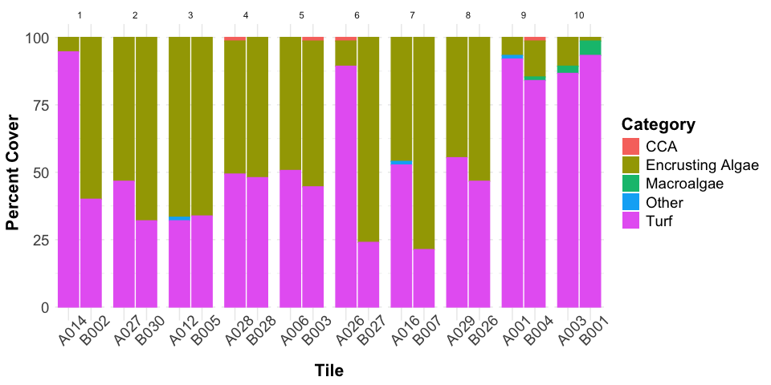
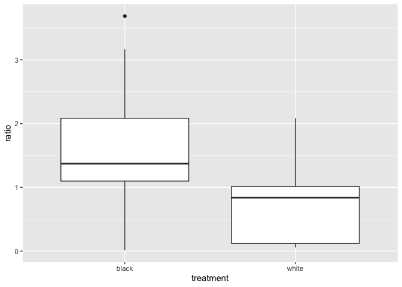
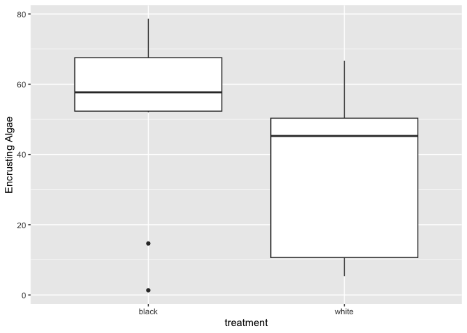
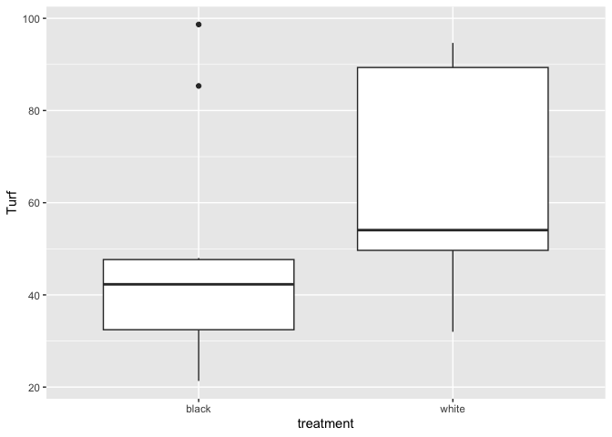

Tile Community Composition Analysis
================
Micaela Chapuis
2026-10-03

## Load Libraries

``` r
library(tidyverse)
library(here)
library(janitor)
```

## Load Data

``` r
cover <- read_csv(here("Data", "pilot_random_annotations.csv")) %>% select(-c(Aux4, Aux5, Row, Column)) %>% clean_names() # remove columns I don't need and clean column names
tile_measurements <- read_csv(here("Data", "Respo", "tile_measurements.csv"))
```

Join with tile measurements and filter out non-respo tiles

``` r
cover <- left_join(cover, tile_measurements, by = c("tile_id" = "tile_ID")) %>% 
  filter(treatment %in% c("white", "black")) %>%
  select(-c("sample_ID", "chamber_volume_ml", "notes"))
```

Edit tile ID to have letter at the beginning so on plots white tiles are
always first

``` r
cover <- cover %>%
  mutate(ID_tile = str_c(str_sub(tile_id, -1), str_sub(tile_id, 1, -2))) # str_c joins two strings, the first one is just the letter (taking the last character out of each tile_id string) and the second one is the numbers (takings everything from the first character to the second to last charafcter)
```

Editing labels

``` r
cover <- cover %>% mutate(label_code = replace_values(label_code,
                                                      "BTurf" ~ "Brown Turf",
                                                      "BEA" ~ "Brown Encrusting",
                                                      "Unk" ~ "Unknown",
                                                      "ABREV" ~ "Asteronema breviarticulatum", 
                                                      "GEA" ~ "Green Encrusting",
                                                     # "CCA"  not including it retains original value
                                                      "Outside" ~ "Outside Area",
                                                      "UnkMacroa" ~ "Unknown Macroalgae",
                                                      "RedTurf" ~ "Red Turf",
                                                      "Bare-Subst" ~ "Bare Substrate",
                                                      "GTurf" ~ "Green Turf",
                                                      "Unk_Inv" ~ "Unknown Invert"))
```

Calculating percent cover by label

``` r
percent_cover <- cover %>% 
  filter(!(label_code %in% c("Outside Area"))) %>% # filter out points outside of the settlement area
  group_by(date, site, tile_id, ID_tile, treatment, deployment_block, label_code) %>%
  summarise(num_points = n()) %>% # calculate number of points for each label
  mutate(total_points = sum(num_points), # create a column with the total points on each tile
         percent_cover = num_points/total_points*100) # calculate percent cover for each label
```

    ## `summarise()` has regrouped the output.
    ## ℹ Summaries were computed grouped by date, site, tile_id, ID_tile, treatment,
    ##   deployment_block, and label_code.
    ## ℹ Output is grouped by date, site, tile_id, ID_tile, treatment, and
    ##   deployment_block.
    ## ℹ Use `summarise(.groups = "drop_last")` to silence this message.
    ## ℹ Use `summarise(.by = c(date, site, tile_id, ID_tile, treatment,
    ##   deployment_block, label_code))` for per-operation grouping
    ##   (`?dplyr::dplyr_by`) instead.

``` r
percent_cover %>% 
  ggplot(aes(x= ID_tile,
               y = percent_cover, 
               fill= label_code, 
               color= label_code)) + # set lines surrounding each color to match the fill colors 
      geom_bar(stat="identity") + # stacked bars
      facet_wrap(~treatment, scales = "free_x") + 
  
      labs(x = "Tile", # labels
           y="Percent Cover",
           fill = "Category") +

      theme_minimal() +  # theme
      theme(title = element_text(size = 18, face = "bold"), # make title bigger and bold
            axis.title = element_text(size = 16), # make all text bigger
            axis.text = element_text(size = 14),
            axis.text.x = element_text(angle = 45, size = 10),
            legend.title = element_text(size = 16),
            legend.text = element_text(size = 14)) +
    guides(color = "none")
```

<!-- -->

``` r
percent_cover %>% 
  ggplot(aes(x= ID_tile,
               y = percent_cover, 
               fill= label_code, 
               color= label_code)) + # set lines surrounding each color to match the fill colors 
      geom_bar(stat="identity") + # stacked bars
      facet_grid(~deployment_block, scales = "free_x") + 
  
      labs(x = "Tile", # labels
           y="Percent Cover",
           fill = "Category") +

      theme_minimal() +  # theme
      theme(title = element_text(size = 18, face = "bold"), # make title bigger and bold
            axis.title = element_text(size = 16), # make all text bigger
            axis.text = element_text(size = 14),
            axis.text.x = element_text(angle = 45, size = 10),
            legend.title = element_text(size = 16),
            legend.text = element_text(size = 14)) +
    guides(color = "none")
```

<!-- -->

Filtering out just producers

``` r
producer_cover <- cover %>% 
  filter(!(label_code %in% c("Outside Area", "Bare Substrate", "Unknown"))) %>%
  group_by(date, site, tile_id, ID_tile, treatment, deployment_block, label_code) %>%
  summarise(num_points = n()) %>% # calculate number of points for each label
  mutate(total_points = sum(num_points), # create a column with the total points on each tile
         percent_cover = num_points/total_points*100) # calculate percent cover for each label
```

    ## `summarise()` has regrouped the output.
    ## ℹ Summaries were computed grouped by date, site, tile_id, ID_tile, treatment,
    ##   deployment_block, and label_code.
    ## ℹ Output is grouped by date, site, tile_id, ID_tile, treatment, and
    ##   deployment_block.
    ## ℹ Use `summarise(.groups = "drop_last")` to silence this message.
    ## ℹ Use `summarise(.by = c(date, site, tile_id, ID_tile, treatment,
    ##   deployment_block, label_code))` for per-operation grouping
    ##   (`?dplyr::dplyr_by`) instead.

``` r
producer_cover %>% 
  ggplot(aes(x= ID_tile,
               y = percent_cover, 
               fill= label_code, 
               color= label_code)) + # set lines surrounding each color to match the fill colors 
      geom_bar(stat="identity") + # stacked bars
      facet_wrap(~treatment, scales = "free_x") + 
  
      labs(x = "Tile", # labels
           y="Percent Cover",
           fill = "Category") +

      theme_minimal() +  # theme
      theme(title = element_text(size = 18, face = "bold"), # make title bigger and bold
            axis.title = element_text(size = 16), # make all text bigger
            axis.text = element_text(size = 14),
            axis.text.x = element_text(angle = 45),
            legend.title = element_text(size = 16),
            legend.text = element_text(size = 14)) +
    guides(color = "none")
```

<!-- -->

## Assign to broader categories

``` r
producer_cat <- cover %>%
  filter(!(label_code %in% c("Outside Area"))) %>% # filter out points outside of the settlement area
  mutate(category = case_when(
    label_code %in% c("Brown Encrusting", "Green Encrusting") ~ "Encrusting Algae",
    label_code %in% c("Brown Turf", "Red Turf", "Green Turf") ~ "Turf",
    label_code %in% c("Asteronema breviarticulatum", "Unknown Macroalgae") ~ "Macroalgae",
    label_code == "CCA" ~ "CCA",
    label_code %in% c("Bare Substrate", "Unknown") ~ "Other")) %>%
  group_by(date, site, tile_id, ID_tile, treatment, deployment_block,  category) %>%
  summarise(num_points = n()) %>% # calculate number of points for each category
  mutate(total_points = sum(num_points), # create a column with the total points on each tile
         percent_cover = num_points/total_points*100) #%>% # recalculate percent cover for each category, total points still the same as before
```

    ## `summarise()` has regrouped the output.
    ## ℹ Summaries were computed grouped by date, site, tile_id, ID_tile, treatment,
    ##   deployment_block, and category.
    ## ℹ Output is grouped by date, site, tile_id, ID_tile, treatment, and
    ##   deployment_block.
    ## ℹ Use `summarise(.groups = "drop_last")` to silence this message.
    ## ℹ Use `summarise(.by = c(date, site, tile_id, ID_tile, treatment,
    ##   deployment_block, category))` for per-operation grouping (`?dplyr::dplyr_by`)
    ##   instead.

``` r
  #filter(!category == "Non-Producers")
```

``` r
producer_cat %>% 
  ggplot(aes(x= ID_tile,
               y = percent_cover, 
               fill= category, 
               color= category)) + # set lines surrounding each color to match the fill colors 
      geom_bar(stat="identity") + # stacked bars
      facet_wrap(~treatment, scales = "free_x") + 
  
      labs(x = "Tile", # labels
           y="Percent Cover",
           fill = "Category") +

      theme_minimal() +  # theme
      theme(title = element_text(size = 18, face = "bold"), # make title bigger and bold
            axis.title = element_text(size = 16), # make all text bigger
            axis.text = element_text(size = 14),
            axis.text.x = element_text(angle = 45),
            legend.title = element_text(size = 16),
            legend.text = element_text(size = 14)) +
    guides(color = "none")
```

<!-- -->

``` r
producer_cat %>% 
  ggplot(aes(x= ID_tile,
               y = percent_cover, 
               fill= category, 
               color= category)) + # set lines surrounding each color to match the fill colors 
      geom_bar(stat="identity") + # stacked bars
      facet_grid(~deployment_block, scales = "free_x") + 
  
      labs(x = "Tile", # labels
           y="Percent Cover",
           fill = "Category") +

      theme_minimal() +  # theme
      theme(title = element_text(size = 18, face = "bold"), # make title bigger and bold
            axis.title = element_text(size = 16), # make all text bigger
            axis.text = element_text(size = 14),
            axis.text.x = element_text(angle = 45),
            legend.title = element_text(size = 16),
            legend.text = element_text(size = 14)) +
    guides(color = "none")
```

<!-- -->

Producer categories by treatment

``` r
producer_cat %>%
  ggplot(aes(x= treatment,
               y = percent_cover, 
               fill= category, 
               color= category)) + # set lines surrounding each color to match the fill colors 
      geom_bar(stat="identity") + # stacked bars
    
      labs(x = "Treatment", # labels
           y="Percent Cover",
           fill = "Category") +

      theme_minimal() +  # theme
      theme(title = element_text(size = 18, face = "bold"), # make title bigger and bold
            axis.title = element_text(size = 16), # make all text bigger
            axis.text = element_text(size = 14),
            legend.title = element_text(size = 16),
            legend.text = element_text(size = 14)) +
    guides(color = "none")
```

<!-- -->

## Encrusting vs Turf

Switching to just encrusting/turf (encrusting includes CCA and turf will
include macro, which for now is just asteronema and other unidentified
small macroalgae)

``` r
encr_turf <- cover %>%
  filter(!(label_code %in% c("Outside Area"))) %>% # filter out points outside of the settlement area
  mutate(category = case_when(
    label_code %in% c("Brown Encrusting", "Green Encrusting", "CCA") ~ "Encrusting Algae",
    label_code %in% c("Brown Turf", "Red Turf", "Green Turf", "Asteronema breviarticulatum", "Unknown Macroalgae") ~ "Turf",
    label_code %in% c("Bare Substrate", "Unknown") ~ "Other")) %>%
  group_by(date, site, tile_id, treatment, deployment_block, category) %>%
  summarise(num_points = n()) %>% # calculate number of points for each category
  mutate(total_points = sum(num_points), # create a column with the total points on each tile
         percent_cover = num_points/total_points*100) %>% # recalculate percent cover for each category, total points still the same as before
  filter(!category == "Non-Producers")
```

    ## `summarise()` has regrouped the output.
    ## ℹ Summaries were computed grouped by date, site, tile_id, treatment,
    ##   deployment_block, and category.
    ## ℹ Output is grouped by date, site, tile_id, treatment, and deployment_block.
    ## ℹ Use `summarise(.groups = "drop_last")` to silence this message.
    ## ℹ Use `summarise(.by = c(date, site, tile_id, treatment, deployment_block,
    ##   category))` for per-operation grouping (`?dplyr::dplyr_by`) instead.

``` r
ratio <- encr_turf %>%
  select(-c("num_points", "total_points")) %>%
  pivot_wider(
    names_from = "category",
    values_from = "percent_cover") %>%
  mutate(ratio = `Encrusting Algae`/Turf)
```

``` r
ratio %>% write.csv(here("Data", "encrusting_turf_ratio.csv"))
```

### Tests

#### Ratio black vs white

``` r
ratio %>% ggplot(aes(x = treatment, y = ratio)) + geom_boxplot()
```

<!-- -->

``` r
# reshape data so each block has a white ratio and a black ratio
block_ratio <- ratio %>% ungroup() %>% select(deployment_block, treatment, ratio) %>%
  pivot_wider(names_from = treatment, values_from = ratio)

block_ratio
```

    ## # A tibble: 10 × 3
    ##    deployment_block  white  black
    ##               <dbl>  <dbl>  <dbl>
    ##  1                9 0.0725 0.172 
    ##  2               10 0.119  0.0135
    ##  3                1 0.0563 1.5   
    ##  4                5 0.974  1.24  
    ##  5                3 2.08   1.96  
    ##  6                7 0.872  3.69  
    ##  7                6 0.119  3.17  
    ##  8                8 0.805  1.14  
    ##  9                2 1.14   2.12  
    ## 10                4 1.03   1.08

``` r
# test whether black tiles have higher encr/turf ratio than white tiles 
# NOT paired (treats black and white tiles as independent samples, is the avg ratio different between all black and all white tiles?)
t.test(block_ratio$black, block_ratio$white)
```

    ## 
    ##  Welch Two Sample t-test
    ## 
    ## data:  block_ratio$black and block_ratio$white
    ## t = 2.0798, df = 14.055, p-value = 0.05633
    ## alternative hypothesis: true difference in means is not equal to 0
    ## 95 percent confidence interval:
    ##  -0.0272492  1.7916467
    ## sample estimates:
    ## mean of x mean of y 
    ## 1.6093170 0.7271182

``` r
# test whether black tiles have higher encr/turf ratio than white tiles 
# paired t-test (is the ratio higher on black tiles than on their paired white tile)
t.test(block_ratio$black, block_ratio$white, paired = TRUE)
```

    ## 
    ##  Paired t-test
    ## 
    ## data:  block_ratio$black and block_ratio$white
    ## t = 2.3479, df = 9, p-value = 0.04345
    ## alternative hypothesis: true mean difference is not equal to 0
    ## 95 percent confidence interval:
    ##  0.03222559 1.73217191
    ## sample estimates:
    ## mean difference 
    ##       0.8821987

#### Encrusting black vs white

``` r
ratio %>% ggplot(aes(x = treatment, y = `Encrusting Algae`)) + geom_boxplot()
```

<!-- -->

``` r
# reshape data so each block has a white encrusting and a black encrusting
block_encr <- ratio %>% ungroup() %>% select(deployment_block, treatment, `Encrusting Algae`) %>%
  pivot_wider(names_from = treatment, values_from = `Encrusting Algae`)

block_encr
```

    ## # A tibble: 10 × 3
    ##    deployment_block white black
    ##               <dbl> <dbl> <dbl>
    ##  1                9  6.67 14.7 
    ##  2               10 10.7   1.33
    ##  3                1  5.33 60   
    ##  4                5 49.3  55.4 
    ##  5                3 66.7  66.2 
    ##  6                7 45.9  78.7 
    ##  7                6 10.7  76   
    ##  8                8 44.6  53.3 
    ##  9                2 53.3  68   
    ## 10                4 50.7  52

``` r
# test whether black tiles have higher encrusting cover than white tiles 
# NOT paired (treats black and white tiles as independent samples, is the avg encr cover different between all black and all white tiles?)
t.test(block_encr$black, block_encr$white)
```

    ## 
    ##  Welch Two Sample t-test
    ## 
    ## data:  block_encr$black and block_encr$white
    ## t = 1.6711, df = 17.868, p-value = 0.1121
    ## alternative hypothesis: true difference in means is not equal to 0
    ## 95 percent confidence interval:
    ##  -4.686385 41.035935
    ## sample estimates:
    ## mean of x mean of y 
    ##  52.56216  34.38739

``` r
# test whether black tiles have higher encrusting cover than white tiles 
# paired t-test (is the encrusting cover higher on black tiles than on their paired white tile)
t.test(block_encr$black, block_encr$white, paired = TRUE)
```

    ## 
    ##  Paired t-test
    ## 
    ## data:  block_encr$black and block_encr$white
    ## t = 2.3237, df = 9, p-value = 0.04521
    ## alternative hypothesis: true mean difference is not equal to 0
    ## 95 percent confidence interval:
    ##   0.4814395 35.8681101
    ## sample estimates:
    ## mean difference 
    ##        18.17477

#### Turf black vs white

``` r
ratio %>% ggplot(aes(x = treatment, y = Turf)) + geom_boxplot()
```

<!-- -->

``` r
# reshape data so each block has a white turf and a black turf
block_turf <- ratio %>% ungroup() %>% select(deployment_block, treatment, Turf) %>%
  pivot_wider(names_from = treatment, values_from = Turf)

block_turf
```

    ## # A tibble: 10 × 3
    ##    deployment_block white black
    ##               <dbl> <dbl> <dbl>
    ##  1                9  92    85.3
    ##  2               10  89.3  98.7
    ##  3                1  94.7  40  
    ##  4                5  50.7  44.6
    ##  5                3  32    33.8
    ##  6                7  52.7  21.3
    ##  7                6  89.3  24  
    ##  8                8  55.4  46.7
    ##  9                2  46.7  32  
    ## 10                4  49.3  48

``` r
# test whether black tiles have higher turf cover than white tiles 
# NOT paired (treats black and white tiles as independent samples, is the avg turf cover different between all black and all white tiles?)
t.test(block_turf$black, block_turf$white)
```

    ## 
    ##  Welch Two Sample t-test
    ## 
    ## data:  block_turf$black and block_turf$white
    ## t = -1.6306, df = 17.882, p-value = 0.1205
    ## alternative hypothesis: true difference in means is not equal to 0
    ## 95 percent confidence interval:
    ##  -40.683403   5.137457
    ## sample estimates:
    ## mean of x mean of y 
    ##  47.43784  65.21081

``` r
# test whether black tiles have higher turf cover than white tiles 
# paired t-test (is the turf cover higher on black tiles than on their paired white tile)
t.test(block_turf$black, block_turf$white, paired = TRUE)
```

    ## 
    ##  Paired t-test
    ## 
    ## data:  block_turf$black and block_turf$white
    ## t = -2.2639, df = 9, p-value = 0.04986
    ## alternative hypothesis: true mean difference is not equal to 0
    ## 95 percent confidence interval:
    ##  -35.5324715  -0.0134744
    ## sample estimates:
    ## mean difference 
    ##       -17.77297
